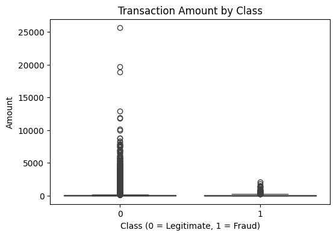

# Credit Card Fraud Detection using Machine Learning
*Machine learning analysis to identify fraudulent credit card transactions and support data-driven fraud detection strategies.*

**Dataset:** 284,807 credit card transactions (492 fraud cases)  
**Techniques:** Exploratory Data Analysis, Logistic Regression, Random Forest  
**Key Result:** Random Forest achieved strong fraud detection performance with ROC-AUC above 0.95 while reducing false positives compared to the baseline model.

---

## Business Context

Credit card fraud is a major challenge for financial institutions. Fraudulent transactions generate direct financial losses and can damage customer trust if not detected quickly.

At the same time, fraud detection systems must avoid blocking legitimate transactions, since excessive false positives negatively affect customer experience and operational efficiency.

My interest in this topic is also influenced by **practical experience working in sales and in a startup environment**, where payment issues and occasional fraud cases appeared in real operational workflows. This motivated a deeper exploration of how data analysis and machine learning can support fraud detection systems.

---

## Dataset

The dataset used in this project comes from Kaggle:  
https://www.kaggle.com/datasets/mlg-ulb/creditcardfraud

It contains credit card transactions made by European cardholders in September 2013. The transactions occurred over a **two-day period** and include a total of **284,807 records**, of which **492 are labeled as fraudulent**.

This means fraudulent transactions represent only **0.17% of the dataset**, making this a **highly imbalanced classification problem**.

For privacy reasons, the original variables were anonymized using **Principal Component Analysis (PCA)**.

Main variables include:

• **V1 – V28:** PCA-transformed features  
• **Time:** Seconds elapsed since the first transaction  
• **Amount:** Transaction value  
• **Class:** Target variable (1 = fraud, 0 = legitimate)

Due to this strong class imbalance, **accuracy alone is not a reliable evaluation metric** for this problem.

---

## Problem Statement

Can machine learning models detect fraudulent credit card transactions effectively while maintaining a reasonable balance between fraud detection and false alerts?

This is challenging because fraud represents a **very small fraction of total transactions**, making traditional classification metrics misleading.

---

## Objectives

• Analyze patterns associated with fraudulent transactions  
• Perform exploratory data analysis (EDA) to understand transaction behavior  
• Train machine learning models for fraud detection  
• Evaluate models using metrics appropriate for imbalanced datasets  
• Translate technical results into insights relevant for fraud prevention

---

## Methodology

1. **Data Preparation**: Splitting the dataset into training and test sets and scaling relevant features.

2. **Exploratory Data Analysis**: Examining transaction distributions, class imbalance and behavioral differences between fraud and legitimate transactions.

3. **Model Training**: Training baseline and ensemble machine learning models.

4. **Model Evaluation**: Evaluating models using precision, recall, F1-score and ROC-AUC to better reflect fraud detection performance.

5. **Interpretation of Results**: Understanding how model performance translates into practical fraud detection implications.

---

## Tools & Technologies

• Python (Pandas, NumPy)  
• Scikit-learn  
• Matplotlib  
• Seaborn  
• Machine Learning Classification Models

---

## Exploratory Data Analysis Highlights

The exploratory analysis revealed several key patterns:

• **Extreme class imbalance:**  
  * Legitimate transactions: **284,315 (99.83%)**  
  * Fraudulent transactions: **492 (0.17%)**


**Figure**: Distribution of legitimate and fraudulent transactions in the dataset.

• **Highly skewed transaction amounts:**  Most transactions involve relatively small values, while a small number reach very high amounts.

• **Fraud tends to occur at lower transaction values**, although some high-value outliers exist.
This pattern is common in financial transaction data and explains why the distribution appears concentrated near zero. It highlights the difficulty of fraud detection and the importance of using appropriate evaluation metrics and modeling strategies.


---

## Modeling Approach

Two models were trained and evaluated:

### Logistic Regression (Baseline Model)

Logistic Regression was used as a baseline model because of its simplicity and interpretability. Class weights were applied to give more importance to fraudulent transactions during training.

#### The model achieved:

Accuracy: **0.98**  
ROC-AUC: **0.97**

#### Fraud detection metrics:

Precision: **0.06**  
Recall: **0.92**

The model successfully detects most fraud cases (high recall), but generates a large number of false positives due to very low precision.

---

### Random Forest (Final Model)

Random Forest was selected as a more powerful model capable of capturing non-linear relationships between features.

Compared to Logistic Regression, Random Forest:

• Achieved a **more balanced precision–recall trade-off**  
• **Reduced false alerts significantly**  
• Maintained strong fraud detection capability

Both models achieved **ROC-AUC scores above 0.95**, indicating strong overall discrimination between fraudulent and legitimate transactions.

For practical fraud detection scenarios, Random Forest provides a **more operationally balanced solution**.

---

## Key Insights

Several important insights emerged from the analysis.

• **Fraud is extremely rare**, representing only **0.17% of transactions**, which makes naive accuracy metrics misleading.

• **Baseline models can detect most fraud cases**, but may generate excessive false positives.

• **Ensemble models such as Random Forest improve operational usability**, balancing fraud detection with manageable alert volumes.

• Fraudulent behavior often occurs at **lower transaction values**, possibly as an attempt to avoid triggering simple rule-based detection systems.

These insights highlight the importance of **careful model evaluation and metric selection** in rare-event detection problems.

---

## Business Impact & Applications

The results of this analysis can support several real-world applications.

**Fraud Detection Systems**  
Machine learning models can automatically flag suspicious transactions for investigation.

**Operational Efficiency**  
Reducing false positives lowers the workload of fraud investigation teams.

**Risk Management**  
Early identification of fraudulent behavior helps reduce financial losses.

**Customer Experience**  
More accurate detection systems reduce the risk of blocking legitimate transactions.

---

## Limitations

Some limitations should be considered:

• The features were anonymized using PCA, which limits interpretability and prevents domain-specific analysis.

• The dataset represents transactions from a specific region and time period.

• The analysis does not incorporate cost-sensitive evaluation, even though fraud detection errors have different financial impacts.

---

## Next Steps

Possible improvements include:

• Applying **resampling techniques** such as SMOTE or undersampling  
• Testing additional models such as **Gradient Boosting or XGBoost**  
• Performing **hyperparameter tuning**  
• Exploring **precision–recall curves and threshold optimization**  
• Incorporating **cost-sensitive evaluation metrics**

---

## Repository Structure

```
.
├── data
├── notebooks
├── images
├── requirements.txt
└── README.md
````

---

## Strategic Perspective

Fraud detection is a typical example of a **rare-event classification problem**, where the main challenge is not simply maximizing accuracy but balancing detection capability with operational feasibility.

My analytical approach is influenced by experience working in different operational environments and countries, where data analysis must often translate into practical decision-making and real business constraints.

---

## Conclusion

This project demonstrates how machine learning models can support fraud detection in highly imbalanced financial datasets.

Through exploratory analysis and model evaluation, it was possible to identify meaningful patterns in transaction behavior and compare modeling strategies.

Beyond predictive performance, the analysis highlights the importance of **choosing appropriate metrics and balancing fraud detection accuracy with operational efficiency**.
